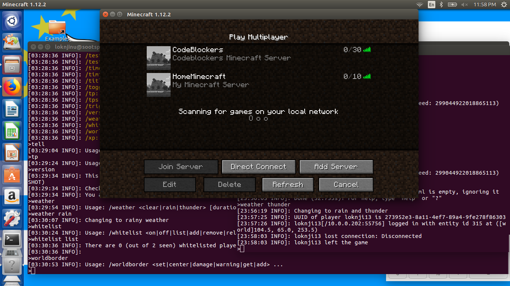
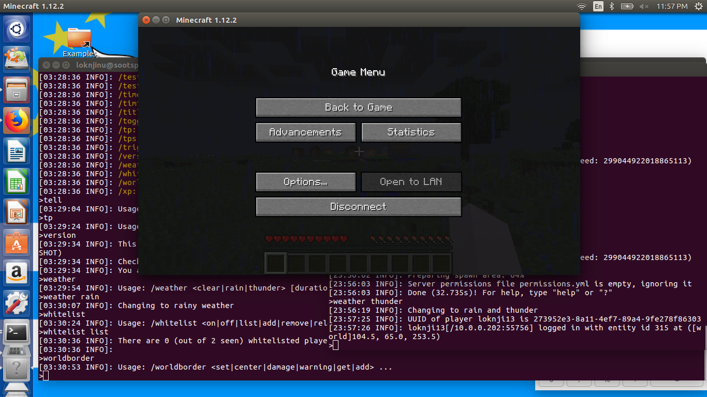
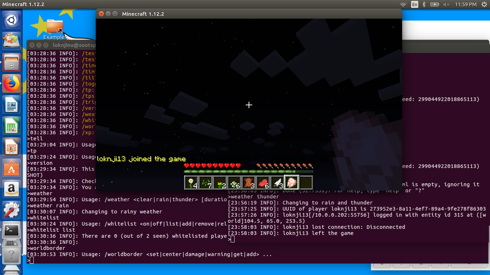
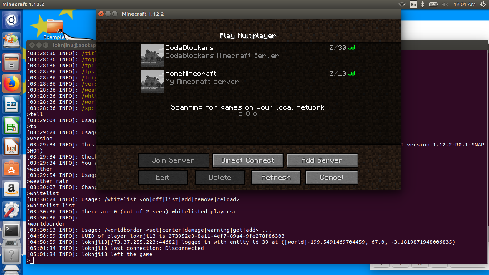

# CSCI2461-71.... 
# FINAL PROJECT
# TEAM; CODE BLOCKERS
#####1. Adam T (Testing) - [Github](https://github.com/Add-man)

#####2. Fongoh LOKNJINU (Research) - [Github](https://github.com/loknjinu13)

#####3. Vangx033 (Testing) -[Github](https://github.com/vangx033)

#####4. Glanel Houenouvi (Documentation) - [Github](href="https://github.com/grenack)

#####5. Kasia Lor (Support) - [Github](https://github.com/klor0610)

This is the first page

This is the second page
# Table of contents
1. [Introduction](#Introduction)
2. [Shortcomings](#Shortcomings)
3. [Hardware Platforms](#Hardware Platforms)
4. [Protocols & Firewall](#Protocols & Firewall)
5. [Raspberry Installation](#Rasberry Installation)
6. [SootSplash Installation](#SootSplash Installation)
7. [Difficulties Encountered](#Difficulties Encountered)
8. [Screen](#Screen)
9. [Deployment Success](#Deployment Success)
10. [Updating Server](#Updating Server)
11. [Recovering Server](#Recovering Server)
12. [Backing Up Server](#Backing Up Server)
13. [Conclusions](#Conclusions)

## Introduction 
A Minecraft Server is what our group deployed for our final project in the Networking 3 - Linux class.
There are five members in the group and each one has a special role to work with.
Check out our Github accounts to find out more and see the documentation that goes along with our project.

## Shortcomings 
	- Mostly online interactions.
	- Some team members dropped.
	- No prior knowledge of the game by remaining team.

## Hardware Platforms 
	a. Raspberry Pi 3(Manual steps Installation)
	b. Raspberry Pi 3(Script Assisted Installation)
	c. SootSplash Server 

## Protocols & Firewall 
 a. Minecraft is compiled using Java. It will use the Transmission Control Protocol(TCP) of the Internet protocol suite.
This permits the connection between users while playing the game.
The following characteristics describe the TCP;
 + Connection oriented
 + Guaranteed reliable
 + 3-way handshake
 + Connection established between two neighbors
 + A send SYN to B
 + B send SYN ACK to A
 + A send ACK to B

  TCP will use Port 25565 in order to establish connection with users from the server.
 b. SSH : Secure Shell is the protocol used to access any of the servers

 c. Firewall: The server needs to be protected from external access. The following will be added in the iptables.
**-A INPUT -p tcp -m state --state NEW --dport 25565 -j ACCEPT**

## Raspberry Installation 

## SootSplash Installation 

## Difficulties Encountered 

## Screen 
## How we used Screen in our Minecraft Server.
Screen is a full-screen window manager that multiplexes a physical terminal between several processes, typically interactive shells.
When a program terminates, _screen_ kills teh window that contained it. 

**TMUX** is another full-screen window manager with capabilities like _screen_ and is being developed.
These softwares permit us to continue from wherever we stopped in our terminals.
We installed screen to assist us control our Minecraft Server from its terminal. 
This is why we include screen in the automatic script to run the server once Ubuntu server boots. This permits the Administrator to run the saerver session.
The following command in our _codebminecraft.sh script_explains it better;
When editing the rc.local file
sudo nano /etc/rc.local
add the foolowing into the line before exit 0...
 screen -dm -S minecraft /opt/scripts/codebminecraft.sh 

Whenever the server is running and you closed theterminal before and will want to check the server,
just run the following command in your session;
_screen -r_

## Deployment Success 
It has been an educative ride for our team. Doing research and testing was fun but getting into difficulties was more educative as it opened up more venues for research.
** Launch Server**

|Platform	|Boot Directory		|Boot Command			|
|---------------|-----------------------|-------------------------------|
|Rasbian	|cd Startup		|sudo ./minecraft.sh		|
|Ubuntu Server	|cd /opt/scripts	|sudo ./codebminecraft.sh	|

It is essential you create automatic backups. Ensure the location is able to store such backups.
Lets use our installed server as an example. In order to play on this Minecraft server, everyone will need a Mojang account to LOGIN. To obtain an account click [Here](https://minecraft.net/en-us/store/minecraft/#register). Now you have an account... You need the _Minecraft Client_ software to access!!! In your Mojang account, there are links to download for Windows, Linux and MAC users. Choose the client software that matches up with your Operating System.

Once your Client software is launched, Choose **Multiplayer**.
This will lead you to insert the name of the server preferably **Code_B_Minecraft**. 
The server address will be _167.99.232.136_.
 **Join The Server** and I will be on alert to Welcome you OnBoard. 
To **_chat_** while in the server, just type **T** on your keyboard.

That's it!

These are pictures of our installation and servers functioning:

Active Servers:

Pi Server:

Pi Server:

Pi Server:

SootSplash Server:

SootSplash Server:

SootSplash Server:

Both Servers:

## Updating Server 

## Recovering Server 

## Backing Up Server 

## Conclusions 

